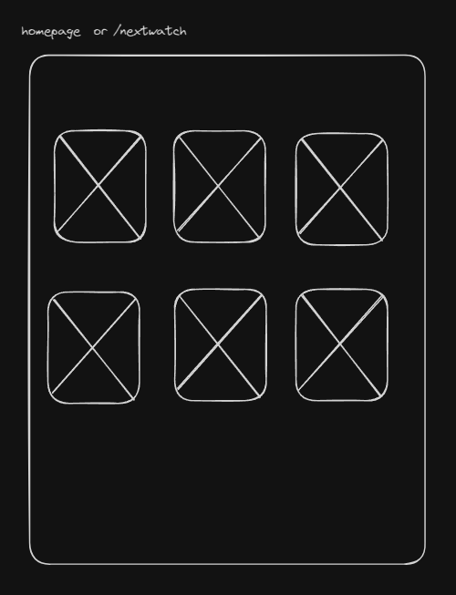
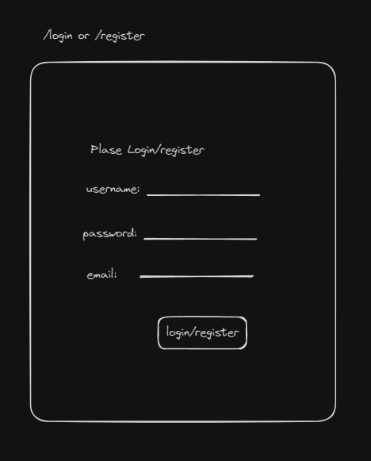
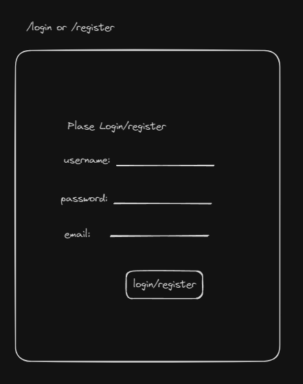
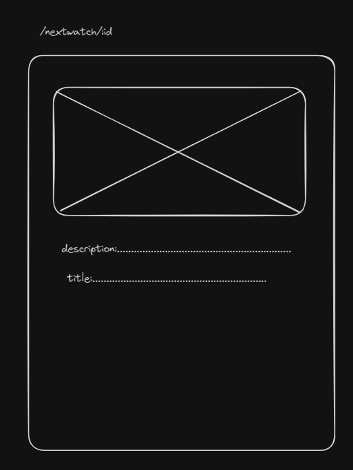
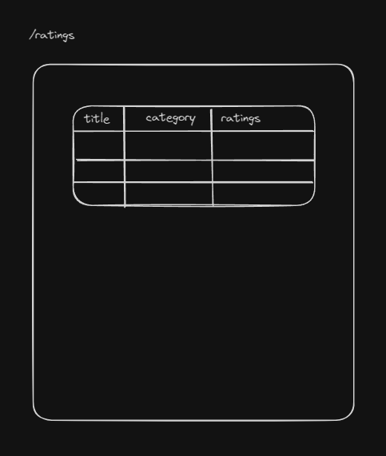
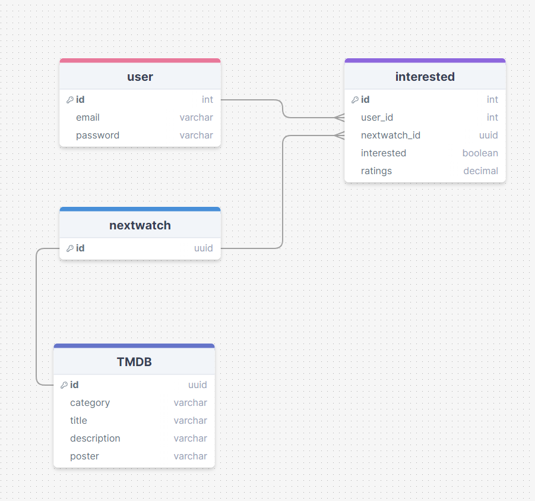

# Project Title

NextWatch

## Overview

What is your app? Brief description in a couple of sentences.

Nextwatch is a place for people to find the upcoming new tvs/movies/animes and keep track of the ones they are interested in.

### Problem

Why is your app needed? Background information around any pain points or other reasons.

Nextwatch shows only the upcoming new movies/tv/animes. A lot of website shows the previous seasons or old shows, which is too much information for people only follow new movies/tvs/animes. Instead, nextwatch is the platform that only focus on new ones and automatically delete the previous season old stuff on the list.

### User Profile

- Movie/TV/Anime new season followers:
- looing for the new season shows/tvs
- that want to keep track of the ones they are interested in
- that don't want to keep track of the previous season stuff

### Features

- As a user, I want to be able to find the upcoming shows/tvs/animes/movies in this season.
- As a user, I want to be able to save a list of the ones that i am interested in.

- As a user, I want to be able to create an account to manage the ones i am interested in.
- As a user, I want to be able to login to my account to manage the ones i am interested in.

- As a logged in user, I want to be able to rate a show on my nextwatch list.
- As a logged in user, I want to be able to change the rating of af the shows out of 10 stars.
- As a logged in user, I want to be able to see my nextwatch list.
- As a logged in user, I want to be able to filter my nextwatch list based on the categories: movies, tv, animes

## Implementation

### Tech Stack

List technologies that will be used in your app, including any libraries to save time or provide more functionality. Be sure to research any potential limitations.

- React
- MySQL
- Express
- Client libraries:
  - react
  - react-router
  - axio
  - sass
- Server libraries:
  - knex
  - express
  - bcrypt for password hashing

### APIs

TMDB

### Sitemap

List the pages of your app with brief descriptions. You can show this visually, or write it out.

- Home page
- List upcoming tvs/movies/animes
- View + Rate a tvs/movies/animes
- Register
- Login

### Mockups

#### Home Page



#### Register Page



#### Login Page



#### tv/movie/anime details Page



#### View Café Page



### Data

Describe your data and the relationships between them. You can show this visually using diagrams, or write it out.



### Endpoints

List endpoints that your server will implement, including HTTP methods, parameters, and example responses.

**GET /nextwatch**

- Get upcoming tv/movie/animes, with an optional "interested" if the user is logged in or not

Parameters:

- token (optional): JWT used to add "interested" boolean

Response:

```
[
    {
        "id": 1
    },
    ...
]
```

NB: the details of the tvs/movies/animes will be fetched from TMDB

**GET /nextwatch/:id**

- Get tvs/movies/animes by id, with an optional "interested" if the user is logged in or not

**POST /nextwatch/:id/rating**

- Logged in user can add their rating of a tv/movies/animes

Parameters:

- id: tv/movies/animes id
- token: JWT of the logged in user
- rating: Number Rating out of 10 in 1 increments

Response:

```
{
    "id": 1,
    "name": "Fallout",
    "userRating": 8
}
```

**POST /users/register**

- Add a user account

Parameters:

- email: User's email
- password: User's provided password

Response:

```
{
    "token": "seyJhbGciOiJIUzI1NiIsInR5cCI6IkpXVCJ9.eyJzdWIiOiIxMjM0NTY3ODkwIiwibmFtZSI6I..."
}
```

**POST /users/login**

- Login a user

Parameters:

- email: User's email
- password: User's provided password

Response:

```
{
    "token": "seyJhbGciOiJIUzI1NiIsInR5cCI6IkpXVCJ9.eyJzdWIiOiIxMjM0NTY3ODkwIiwibmFtZSI6I..."
}
```

### Auth

Does your project include any login or user profile functionality? If so, describe how authentication/authorization will be implemented.

- JWT auth
  - Before adding auth, all API requests will be using a fake user with id 1
  - Added after core features have first been implemented
  - Store JWT in localStorage, remove when a user logs out
  - Add states for logged in showing different UI in places listed in mockups

## Roadmap

Scope your project as a sprint. Break down the tasks that will need to be completed and map out timeframes for implementation. Think about what you can reasonably complete before the due date. The more detail you provide, the easier it will be to build.

- Create client

  - react project with routes and boilerplate pages

- Create server

  - express project with routing, with placeholder 200 responses

- Create migrations

- get the TMDB upcoming tvs/movies/animes data id and store it to the database

- Create seeds with stored tvs/movies/animes data

- Deploy client and server projects so all commits will be reflected in production

- Feature: List tvs/movies/animes

  - Implement list tvs/movies/animes page
  - Create GET /nextwatch endpoint

- Feature: View tvs/movies/animes details

  - Implement view tvs/movies/animes details page
  - Create GET /nextwatch/:id

- Feature: Rate tvs/movies/animes

  - Add form input to view tvs/movies/animes page
  - Create POST /ratings
  - States for add & update ratings

- Feature: Home page

- Feature: Create account

  - Implement register page + form
  - Create POST /users/register endpoint

- Feature: Login

  - Implement login page + form
  - Create POST /users/login endpoint

- Feature: Implement JWT tokens

  - Server: Update expected requests / responses on protected endpoints
  - Client: Store JWT in local storage, include JWT on axios calls

- Bug fixes

- DEMO DAY

## Nice-to-haves

Your project will be marked based on what you committed to in the above document. Under nice-to-haves, you can list any additional features you may complete if you have extra time, or after finishing.

- different tech stack like mongodb for the database
- includes testing like react testing
- deployment
