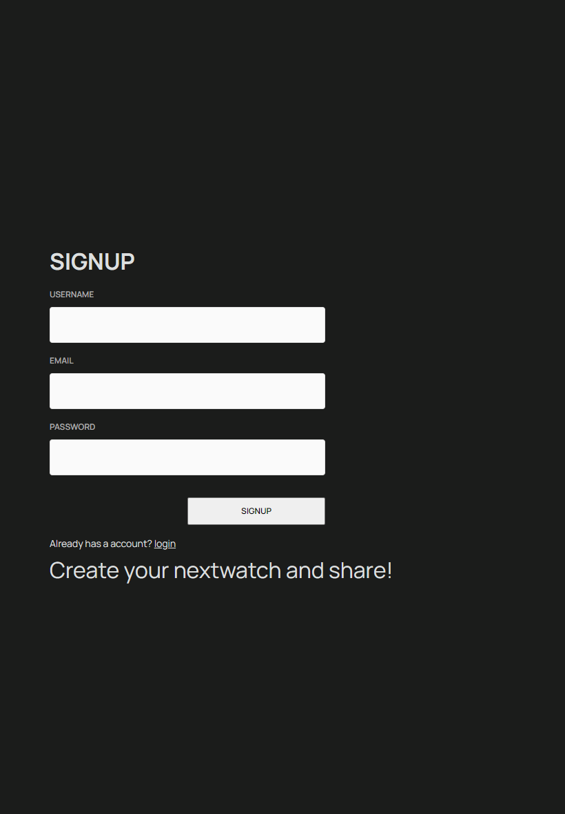
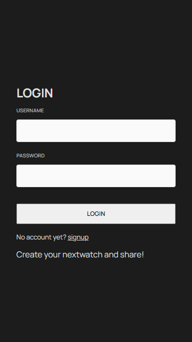
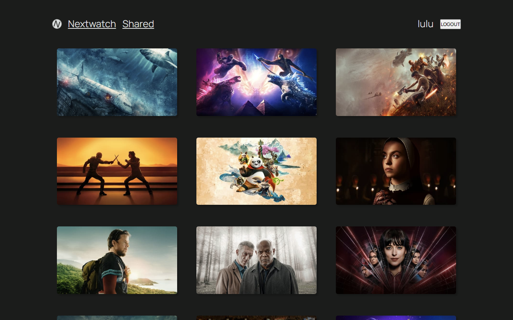

# Project Title

NextWatch

## Overview

Nextwatch is a place for people to find the upcoming new tvs/movies and keep track of the ones they are interested in by creating a list called nextwatch and share it with other users.

### Problem

For the new tvs/movies that's coming out, when decide what to watch together with your friends or family, there should be an app or website that allow you to create a list of them and also includes the basic information, so you can share with them in one place and decide together.

### User Profile

- Movie/TV/Anime new season followers:
- looking for the new season shows/tvs
- that want to keep track of the ones they are interested in
- that want to share the list with the people that is going to watch it together

### Features

- As a user, I want to be able to create an account.
- As a user, I want to be able to login to my account.
- As a user, I want to be able to logout to my account.

- As a logged in user, I want to be able to find the new shows/tvs/animes/movies in this season.
- As a logged in user, I want to be able to save a list of the ones that i am interested in.
- As a logged in user, I want to be able to rate a show on my nextwatch list.
- As a logged in user, I want to be able to change the rating of af the shows out of 10 stars.
- As a logged in user, I want to be able to see my nextwatch list.
- As a logged in user, I want to be able to share my nextwatch list with other users by publishing it on the shared page.

## Implementation

### Tech Stack

- React
- TypeScript
- MongoDB
- Express
- Client libraries:
  - react
  - react-router-dom
  - react-youtube
  - axios
  - sass
- Server libraries:
  - express
  - express-async-errors
  - bcrypt
  - jsonwebtoken
  - mongoose
  - axios
  - cors
  - dotenv

### APIs

TMDB: seedData.js is the script wrote to fetch and sanitize the initail data from TMDB to save to the mongodb database.

### Sitemap

- Signup
- Login
- Home page: a list of new tvs/movies/animes that is the same for all users
- WatchDetails page: one page per a tv/movie with youtube video that is the same for all users
- Nextwatch page: a private page per user, it lists a table of all the tv/movies that the user is interested in
- Shared page: a public page that is available to all users, it lists the nextwatch that other users choose to share

### Mockups

#### Signup Page

tablet/desktop view

#### Login Page

mobile view

tablet/desktop view

#### Home Page

mobile view

tablet view

desktop view

#### WatchDetails (tv/movie) Page

mobile/tablet/desktop view

#### Nextwatch Page

mobile/tablet/desktop view

#### Shared Page

mobile/tablet/desktop view

